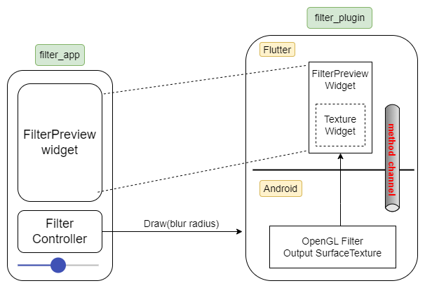

# Flutter OpenGL
In this tutorial we will see how to run OpenGL in Flutter on Android.

We will run a simple gaussian blur filter and control the blur radius using a slider in the app.

[YouTube video](https://www.youtube.com/watch?v=8PjeaY2d8Ok)

# Architecture
There are 2 projects in this demo
1. filter_plugin - This is where we will write our OpenGL filter, we write on as a separate Flutter Plugin.
1. filter_app - This is our main app that will use the filter plugin.

Here is a simple diagram of the entire solution:



## Filter App
Nothing special in here, just a simple program that loads an image and renders it using the `FilterPreview` widget from the filter plugin.

## Filter Plugin
The plugin is also split into 2:
1. The "Flutter" side, this is where we will develop the `FilterPreview` Widget that our app will use
1. The "Android" side, this is where we will develop the OpenGL filter, this is native Android code with a regular OpenGL program.

In the Android side of our plugin we are going to ask Flutter to get us a Surface Texture, and we will use this surface texture as the output of our OpenGL program.

Then in the Flutter side of our plugin we are going to develop a `FilterPreview` widget just renders that SurfaceTexture using Flutter's `Texture` widget (which renders a native surface texture using its id).

# The Texture widget
Ok, so in order to display OpenGL content in Flutter we need to use the [Texture Widget](https://api.flutter.dev/flutter/widgets/Texture-class.html), per the documentation:
> A rectangle upon which a backend texture is mapped... Backend textures are images that can be applied (mapped) to an area of the Flutter view. They are created, managed, and updated using a platform-specific texture registry. This is typically done by a plugin that integrates with host platform video player, camera, or OpenGL APIs, or similar image sources

The way we use this Texture widget is as follow:
```dart
return AspectRatio(
	aspectRatio: ...,
	child: Texture(
		textureId: the id of and output surface texture,
	)
);
```
So how do we get a SurfaceTexture and how do we connect it with OpenGL?

# The SurfaceTexture
Our filter plugin class inherits from `FlutterPlugin` (like all plugins). When our plugin is getting loaded its `onAttachedToEngine` method will get called, and one of the parameters is a `FlutterPluginBinding`. Using this `FlutterPluginBinding` we can creaet a surface texture:
```kotlin
flutterSurfaceTexture = pluginBinding!!.textureRegistry.createSurfaceTexture()
```

## Connecting to OpenGL
Once we have our output surface texture we can use it when we initialize our OpenGL window surface:
```kotlin
mEGLSurface = EGL14.eglCreateWindowSurface(mEGLDisplay, configs[0], outSurfaceTexture, surfaceAttribs, 0)
```
And then after we called the `drawArrays` method to run our OpenGL program we can render the output onto our surface texture by calling to:
```kotlin
EGL14.eglSwapBuffers(mEGLDisplay, mEGLSurface)
```

# End
That's pretty much a high-level overview of the solution, more details and code walkthrough are in this YouTube video.


Demo app Matterhorn image [ingmar on Unsplash](https://unsplash.com/s/photos/ingmar)
